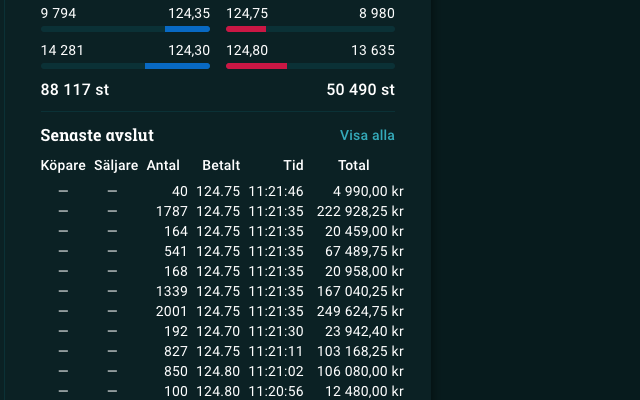

# Avanza+

Avanza+ fungerar i bakgrunden och har inget GUI så ni kan 'dölja' pluginet om ni högerklickar på ikonen i högra hörnet på browsern.

# Todo
- Uppdatera innehavs värde i realtid med senaste kurs / (marketmaker).
- När marketmaker finns, färgge köp och sälj i avsluten. Köp av marketmaker = blå, Sälj mot marketmaker = röd
- Rita graf med tidsserie och Y = marketmaker kurs

# Kända buggar
