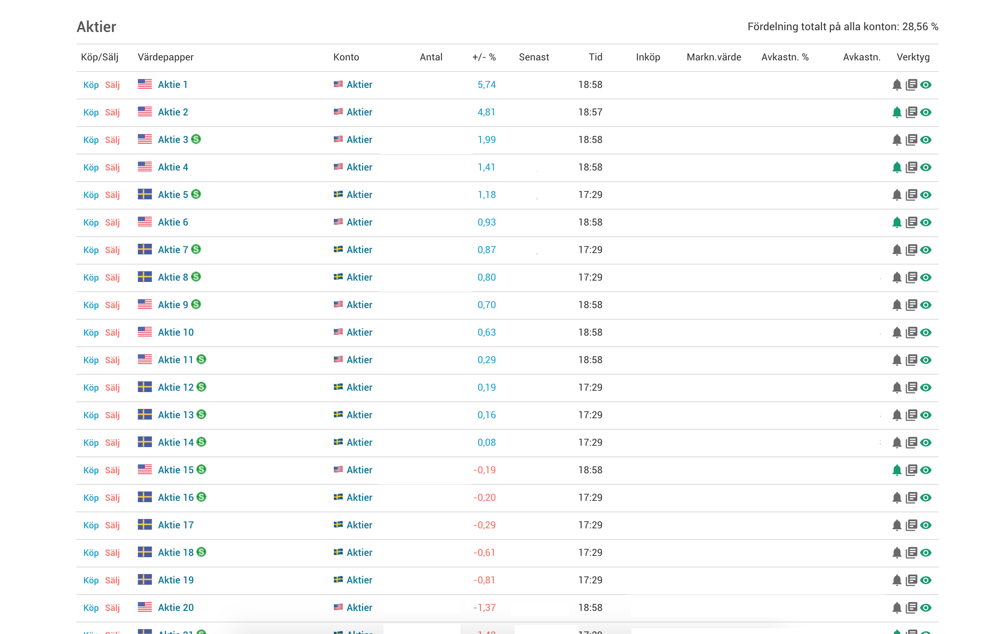
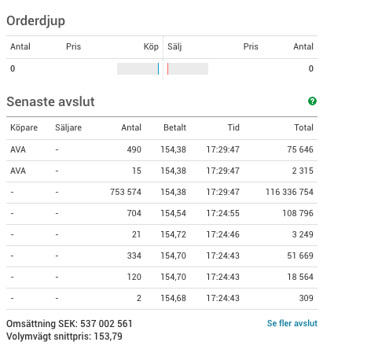

Avanza+
=====

Avanza+ fungerar i bakgrunden och har inget GUI så ni kan 'dölja' pluginet om ni högerklickar på ikonen i högra hörnet på browsern. 

Ni kan exempelvis:
- Sortera på % förändring idag.
- Sortera på avkastning %.
- Se en extra kolumn i "Senaste avslut" som visar totalsumman av varje avslut.

Todo:
- Nettoköpare/nettosäljare senaste 5min/10min/15min osv. T.ex certifikat, köper man mer nu än de senaste minutrarna? osv. 
- Öka senaste avslut listans längd. Senaste 20 avsluten t.ex.

