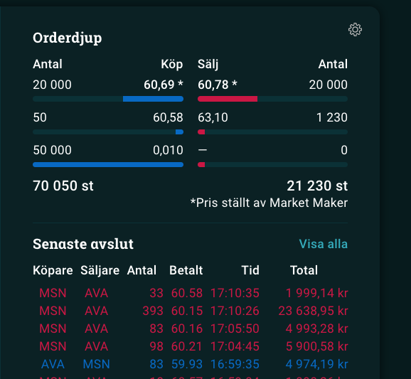
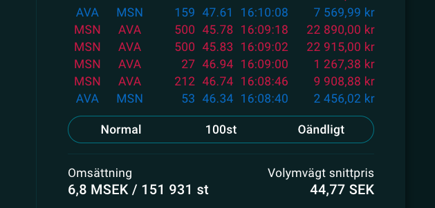

# Avanza+

Avanza+ fungerar i bakgrunden och har inget GUI så ni kan 'dölja' pluginet om ni högerklickar på ikonen i högra hörnet på browsern.

# Hur man installerar
- Ladda ned repo:t genom att klicka på gröna "<> Code"-knappen och välj "Download zip"
- Unzippa mappen
- Gå tillbaka till Chrome och besök sidan [chrome://extensions](chrome://extensions/)
- Högst upp i höger hörn. Bocka i "Developer mode"
- Klicka på "Load unpacked" i övre-vänster hörn
- Välj mappen "avanzaplus-master" > "publish"
- Nu är den aktiv och du kan besöka Avanza och få allt det goda.

# Demo

# Todo
- Uppdatera innehavs värde i realtid med senaste kurs / (marketmaker).
- Rita graf med tidsserie och Y = marketmaker kurs

# Kända buggar