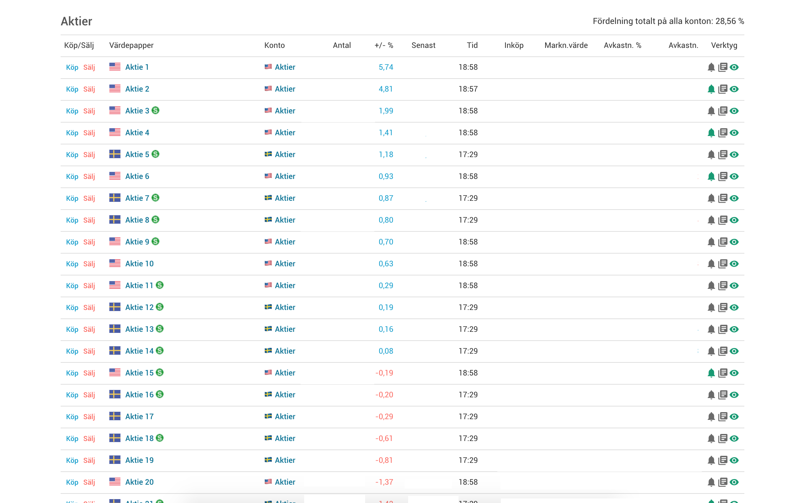
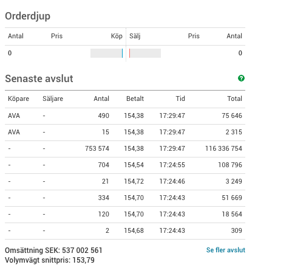

# Avanza+

Avanza+ fungerar i bakgrunden och har inget GUI så ni kan 'dölja' pluginet om ni högerklickar på ikonen i högra hörnet på browsern.

Ni kan exempelvis:

- Sortera på % förändring idag.
- Sortera på avkastning %.
- Se en extra kolumn i "Senaste avslut" som visar totalsumman av varje avslut.
- Se 25 avslut istället för 8 (laddas in dynamsikt).

Se backloggen för todo's och lägg till fler om ni har synpunkter.

[Backlog](https://github.com/lindbergan/avanzaplus/projects/1)

